# Optimizing CNN Architectures Using Guided-Backpropagation for Image Classification

## 🔍 Introduction
Convolutional Neural Networks (CNNs) have achieved remarkable success in various image classification tasks across diverse domains. However, a common problem in CNN is overparameterization, which may lead to a model becoming overfit on a training dataset. This issue is especially critical in many real-world datasets that have limited variation or small samples sizes. Although traditional methods such as analyzing loss and accuracy curves are commonly used to detect overfitting in CNNs, they just show little understanding of what the model is actually learning or how its architecture might be improved. This project focuses on explaining overfitting by analyzing the features learned at different depths of the CNN model with Guided Backpropagation technique. By visualizing the progression of feature maps throughout the network, we can better understand how information evolves through the network and determine the point at which further layers stop contributing meaningful representations. Based on this insight, we identify the optimal layer at which to truncate the model - effectively removing the redundant layers - by evaluating the similarity between feature maps across layers using the Structural Similarity Index Measure (SSIM), resulting in a more efficient and streamlined architecture. 

This project is based on the paper: **[Visualizing Feature Maps for Model Selection in Convolutional Neural Networks](https://openaccess.thecvf.com/content/ICCV2021W/CVPPA/papers/Mostafa_Visualizing_Feature_Maps_for_Model_Selection_in_Convolutional_Neural_Networks_ICCVW_2021_paper.pdf)** for implementing code and conducting experiments to demonstrate its performance. 

## 🔁 Methodology Pipeline

This project follows a step-by-step pipeline to analyze and optimize CNN architectures:

### 1️⃣ Train Base Model
A CNN model (e.g., VGG, ResNet, EfficientNet) with full architecture is trained on the dataset to serve as the baseline architecture.

### 2️⃣ Visualize Feature Maps with Guided Backpropagation 
**Guided Backpropagation (GBP)** is a gradient-based visualization technique that computes the gradient of the output with respect to the input image when backpropagating through the Relu activation function. This highlights which parts of the input image contribute most to the network's activations.
In this step, GBP is applied at each ReLU layer of the trained CNN to extract feature maps, allowing us to visualize how information is transformed and propagated through the network. These visualizations provide valuable insights into the learning behavior and the contribution of each layer.

### 3️⃣ Compute Layer-wise Similarity using SSIM
**Structural Similarity Index Measure (SSIM)** is used to measure **similarity between adjacent feature maps**. High similarity suggests **redundant representations**, while lower similarity indicates layers learning new features. This provides a quantitative view of feature redundancy across the depth of the network.

### 4️⃣ Determine Optimal Cut-Off Layer (Elbow Point)  
SSIM trends across layers are averaged and plotted. Using the **KneeLocator** algorithm, the **elbow point** is automatically identified - where meaningful feature learning stops improving.

### 5️⃣ Redesign the Model Architecture 
The model is truncated at the elbow point to remove redundant layers. A new classification head is added to the remaining layers to form a more efficient and streamlined architecture.

### 6️⃣ Retrain the Truncated Model 
The newly designed cut model is **retrained** on the same dataset, using the same pipeline as the baseline model.

### 7️⃣ Evaluate and Compare Performance
Both the **full model** and the **truncated model** are evaluated using standard metrics (e.g., accuracy).

## 🗂️ Datasets

We conduct experiments on two benchmark datasets to evaluate the effectiveness of the proposed method:

### 🌱 V2 Plant Seedlings Dataset
The V2 Plant Seedlings Dataset contains images of crop and weed seedlings belonging to 12 classes. The images were captured under controlled conditions at different growth stages, making it a useful benchmark for plant classification tasks in agriculture.

<strong>📸 Example Images for 12 Classes</strong>

<table align="center">
  <tr>
    <td align="center" width="150px">
      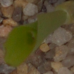 <b style="font-size: 15px;">Maize</b>
    </td>
    <td align="center" width="150px">
      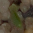 <b style="font-size: 15px;">Common Wheat</b>
    </td>
    <td align="center" width="150px">
      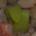 <b style="font-size: 15px;">Sugar Beet</b>
    </td>
    <td align="center" width="150px">
      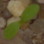 <b style="font-size: 15px;">Scentless Mayweed</b>
    </td>
    <td align="center" width="150px">
      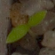 <b style="font-size: 15px;">Chickweed</b>
    </td>
    <td align="center" width="150px">
       <b style="font-size: 15px;">Shepherd's Purse</b>
    </td>
  </tr>
  <tr>
    <td align="center" width="150px">
      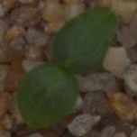 <b style="font-size: 15px;">Cleavers</b>
    </td>
    <td align="center" width="150px">
      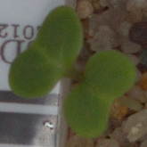 <b style="font-size: 15px;">Charlock</b>
    </td>
    <td align="center" width="150px">
      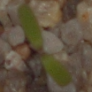 <b style="font-size: 15px;">Fat Hen</b>
    </td>
    <td align="center" width="150px">
       <b style="font-size: 15px;">Cranesbill</b>
    </td>
    <td align="center" width="150px">
      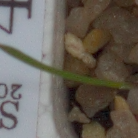 <b style="font-size: 15px;">Black-grass</b>
    </td>
    <td align="center" width="150px">
       <b style="font-size: 15px;">Loose Silky-bent</b>
    </td>
  </tr>
</table>

### 🧪 NEU Surface Defect Dataset (NEU-CLS)
The NEU-CLS dataset consists of grayscale images labeled with 9 classes of surface defects. It is commonly used in industrial inspection and defect classification tasks.

<strong>📸 Example Images for 9 Classes</strong>

<table align="center">
  <tr>
    <td align="center" width="150px">
      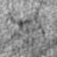 <b style="font-size: 15px;">CR</b>
    </td>
    <td align="center" width="150px">
      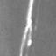 <b style="font-size: 15px;">GG</b>
    </td>
    <td align="center" width="150px">
      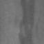 <b style="font-size: 15px;">IN</b>
    </td>
    <td align="center" width="150px">
      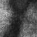 <b style="font-size: 15px;">PA</b>
    </td>
    <td align="center" width="150px">
       <b style="font-size: 15px;">PS</b>
    </td>
  </tr>
  <tr>
    <td align="center" width="150px">
      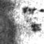 <b style="font-size: 15px;">RP</b>
    </td>
    <td align="center" width="150px">
      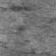 <b style="font-size: 15px;">RS</b>
    </td>
    <td align="center" width="150px">
      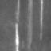 <b style="font-size: 15px;">SC</b>
    </td>
    <td align="center" width="150px">
      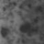 <b style="font-size: 15px;">SP</b>
    </td>
  </tr>
</table>

## 🧪 Experiments and Results
In this section, we show the experimental results at each stage of the pipeline:

### 1️⃣ Train Base Model
We use **ResNet-152** as the base architecture for experiments. The model is trained on each dataset using standard training procedures. After training, we evaluate the model on the training, validation, and test sets.

#### 📊 Accuracy of ResNet-152 (Baseline)

| Dataset                | Train Accuracy | Validation Accuracy | Test Accuracy |
|:----------------------:|:--------------:|:-------------------:|:-------------:|
| V2 Plant Seedlings     |    100.0%      |        81.85%       |     77.43%    |
| NEU-CLS Surface Defect |    99.88%      |        92.02%       |     86.93%    |

### 2️⃣ Visualize Feature Maps with Guided Backpropagation
After training the ResNet-152 baseline model, we apply **Guided Backpropagation (GBP)** to visualize how the network learns features at different depths. ResNet-152 contains **51 ReLU layers**, each representing a unique transformation stage in the network. For each input image, GBP is applied at every ReLU layer to generate a feature visualization, resulting in **51 gradient-based maps**. These maps help us understand how the model focuses on specific parts of the image.

